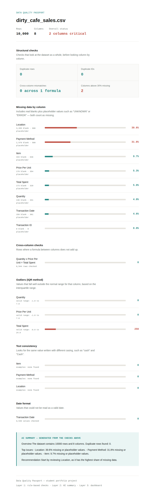
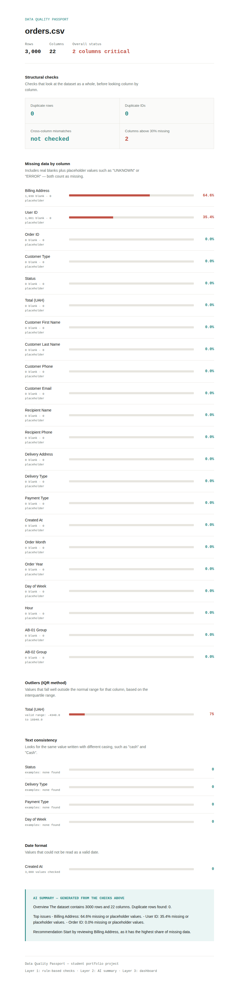

# Data Quality Toolkit

[](https://github.com/Yanaantonyuk/data-quality-passport/actions/workflows/tests.yml)
[](https://colab.research.google.com/github/Yanaantonyuk/data-quality-passport/blob/main/demo.ipynb)

A small Python library for checking and cleaning messy data — designed to be imported directly into your own notebook, not just run as a standalone script.

```
pip install git+https://github.com/Yanaantonyuk/data-quality-passport.git
```

```python
from data_quality_toolkit import load_dataset, quality_report, fill_disguised_missing, fill_missing, flag_outliers

df = load_dataset('my_file.csv')
report = quality_report(df)

df = fill_disguised_missing(df)
df = fill_missing(df, 'Price', strategy='median')
df = flag_outliers(df, 'Total Spent')
```

Click the "Open in Colab" badge above for a runnable walkthrough — no setup beyond the first cell.

This is a personal project. It is not connected to any real company or commercial dataset.

## How this compares to other tools

If you don't already know these, it's worth checking them out — they solve a broader problem than this does:

- **[ydata-profiling](https://github.com/ydata-ai/ydata-profiling)** (formerly pandas-profiling) — one line (`ProfileReport(df)`) gives you a full exploratory data analysis report: distributions, correlations, everything. If you want a broad first look at a new dataset, use this, not mine.
- **[great_expectations](https://github.com/great-expectations/great_expectations)** — the standard for production data validation, with expectation suites that plug into Airflow/dbt/CI pipelines. If you need automated checks that run on every data load and alert someone when they fail, that's the right tool, not this one.

What this project actually adds on top of those: disguised missing values (`"UNKNOWN"`, `"ERROR"` treated as real gaps, which a standard profiler will not flag), and cleaning functions that refuse to run rather than silently overwrite real data with blanks when pointed at the wrong column. That's a narrower, more specific thing than full EDA or pipeline validation.

Also worth knowing before you reach for this: it's pandas-based and in-memory only (no out-of-core or big-data support), and it's built as an interactive notebook tool, not something designed to run unattended inside a CI/CD pipeline.

## Why I redesigned this

I first built this as two standalone scripts you would run from the command line, each with a config block at the top listing your columns and settings. It worked, but it did not match how I actually work with data — in a notebook, cell by cell, trying something, looking at the result, adjusting. Editing a config file and rerunning a whole script for every small change was slower than just writing the pandas myself.

So the core logic now lives in `data_quality_toolkit` as plain functions you import and call directly, in whatever order you want, in your own notebook. The two original scripts (`data_quality_tool.py` and `data_cleaning_assistant.py`) still exist and still work — they are now thin wrappers around the same library, useful if you want to just run something and get a shareable HTML report without writing any code, or if you're on Google Colab. But the library is the real product now.

## Use it in your own notebook

The library has two kinds of functions:

**Diagnosis** — `quality_report(df)` runs every check in one call and returns a dict with the numbers (missing values, duplicates, outliers, text casing issues, date problems). Nothing here changes your data.

**Cleaning** — small, focused functions that each do one thing and return a new DataFrame, so you can chain them however makes sense for your data:

```python
df = fill_disguised_missing(df)               # "UNKNOWN"/"ERROR" -> real NaN
df = fill_missing(df, 'Price', 'median')       # or 'mode', or any literal value
df = standardise_casing(df, 'Payment Method')  # "cash" and "Cash" -> one spelling
df = standardise_dates(df, 'Order Date')       # consistent YYYY-MM-DD format
df = flag_outliers(df, 'Total Spent')          # adds a flag column, never deletes
```

For dropping rows with missing values, there is no wrapper — just use pandas' own `df.dropna(subset=['column'])`. It is already a one-liner; wrapping it would not add anything.

Every cleaning function refuses to run if it would clearly overwrite real data with blanks — for example, `fill_missing(df, 'City', 'median')` on a column that is not actually numeric returns the DataFrame unchanged with a warning, rather than converting your city names to NaN. I found this the hard way while testing an earlier version of this code.

When you want to share results with someone who is not going to read a DataFrame, turn the report into a dashboard or a plain-language summary:

```python
from data_quality_toolkit import ai_summary, generate_dashboard

summary_text = ai_summary(report)                       # optional, needs an API key
generate_dashboard(report, summary_text, 'report.html')  # always works
```

## Tool 1: Data Quality Passport (command-line version)

### What it checks

- **Missing values**, including real blanks and disguised placeholders (`UNKNOWN`, `ERROR`, `N/A`, etc.)
- **Duplicate rows** and duplicate IDs
- **Cross-column consistency**, for example checking that `Quantity x Price = Total`
- **Outliers**, using the IQR method
- **Text consistency**, catching the same value written with different casing (`Cash` vs `cash`)
- **Date format issues**, values that fail to parse as a valid date

### How it works

The tool runs in three layers:

1. **Rule-based checks** — plain Python and pandas, no AI involved. This builds a JSON report with all the numbers.
2. **AI summary** — the JSON report is sent to Claude with a strict instruction: only describe what is in the numbers, never guess at causes. If no API key is available, the tool falls back to a simple rule-based summary instead of failing.
3. **Dashboard** — the report and the summary are rendered into a single HTML file, with a light or dark theme depending on the device.

After `pip install`, this is also available as a command: `dqp-check --csv your_file.csv`.

## Tool 2: Data Cleaning Assistant (command-line version)

`data_cleaning_assistant.py` runs the same cleaning functions as above, but on a whole file at once, using a strategy you set per column, and saves a cleaned file plus a full log. Never touches the original file.

You choose a strategy per column in the config:

```python
CLEANING_STRATEGY = {
    'Location': 'drop',           # remove rows where this is missing
    'Payment Method': 'mode',     # fill with the most common value
    'Price Per Unit': 'median',   # fill with the median (numbers only)
    'Category': 'Unknown',        # anything else is used as a literal fill value
}
DEFAULT_STRATEGY = 'flag_only'    # for any column not listed above
```

Every change is written to `cleaning_log.json`, so nothing happens invisibly — you can always see exactly what was filled, dropped, or standardised, and why.

This script (and `data_quality_tool.py`) both import `data_quality_toolkit`. If you installed the package with pip, this already works from anywhere. If you're running from the repo without installing it, keep all files in the same folder.

Run it the same way as the main tool:
```
python data_cleaning_assistant.py --csv your_file.csv
```
Or, after `pip install`, as a command: `dqp-clean --csv your_file.csv`

## Example output

Tested on two very different datasets to check the tool holds up:

- **Dirty Cafe Sales** (Kaggle, intentionally messy, 10,000 rows) — found that `Location` and `Payment Method` had over 30% missing or placeholder values, much higher than a basic null check would show.



- **My own e-commerce dataset** (already cleaned in an earlier project) — correctly reported no serious issues, and explained that the missing `User ID` values were guest orders, not errors.



That second test mattered to me. A tool that always finds "problems" is not actually useful — I wanted to see it stay quiet on data that is genuinely fine.

## Project structure

```
data-quality-passport/
├── .github/
│   └── workflows/
│       └── tests.yml           # runs test_tool.py automatically on every push
├── data_quality_toolkit/       # the library package — import this into your own notebook
│   └── __init__.py
├── data_quality_tool.py        # CLI wrapper: finds problems, produces a dashboard
├── data_cleaning_assistant.py  # CLI wrapper: fixes what Passport found
├── demo.ipynb                  # runnable walkthrough, open in Colab (badge at the top)
├── pyproject.toml              # makes this pip-installable
├── test_tool.py                # a few basic tests, run with: python test_tool.py
├── requirements.txt
├── .gitignore
├── LICENSE
├── example_output/
│   ├── quality_report.json           # raw numbers from layer 1
│   ├── dashboard.html                # final dashboard (cafe example)
│   ├── dirty_cafe_dashboard.png      # screenshot, messy dataset
│   ├── atelier_orders_dashboard.png  # screenshot, already-cleaned dataset
│   ├── cleaned_data_example.csv      # cafe dataset after cleaning
│   └── cleaning_log_example.json     # what the cleaning step changed
└── README.md
```

## Installing

```
pip install git+https://github.com/Yanaantonyuk/data-quality-passport.git
```

This installs the `data_quality_toolkit` library, plus two command-line tools: `dqp-check` and `dqp-clean`.

If you'd rather not install anything and just want to poke around, clone or download the repo instead and run the scripts from inside that folder — `python data_quality_tool.py` works the same way, it just is not available as a `dqp-check` command from anywhere else on your machine.

## How to run the command-line tools

1. (Optional) Set your Anthropic API key as an environment variable to get the AI-written summary:
   ```
   export ANTHROPIC_API_KEY=your-key-here
   ```
   Without a key, `dqp-check` still works, using a simpler fallback summary.
2. Run it:
   ```
   dqp-check --csv your_file.csv
   dqp-check --csv your_file.xlsx --sheet "Sheet name"
   dqp-clean --csv your_file.csv
   ```
   (Or `python data_quality_tool.py --csv ...` / `python data_cleaning_assistant.py --csv ...` if running from the repo without installing.)
3. Open `data_quality_passport.html` in your browser.

To check that the core logic works as expected, run the small test file from inside the repo:
```
python test_tool.py
```

## VS Code

VS Code does not replace Python, it is just an editor — install Python first from [python.org](https://python.org), then open this folder in VS Code. It will detect Python automatically and gives you a built-in terminal to run the commands above.

## If the auto-detection gets a column wrong

`ID_COLUMN`, `DATE_COLUMNS`, `OUTLIER_COLUMNS` and `TEXT_CONSISTENCY_COLUMNS` are all set to `'auto'` by default. The tool guesses these from the data — for example, a column is treated as a date if most of its values can be parsed as one. These are heuristics, not certainties, and they can guess wrong, especially on datasets very different from the ones this was tested on.

Every time you run the script, it prints exactly which columns it picked for each check, right at the start:

```
Columns used for checks:
  ID column: Order ID
  Date columns: ['Created At']
  Outlier columns: ['Total (UAH)']
  Text consistency columns: ['Status', 'Payment Type']
```

Check this list against what you know about your dataset. If something looks wrong — for example, a column that is actually a phone number ends up in `Outlier columns` — open the CONFIG section at the top of `data_quality_tool.py` and replace `'auto'` with your own list, just for that one setting:

```python
OUTLIER_COLUMNS = ['Total (UAH)', 'Quantity']
```

You do not need to override all four settings, only the ones that got something wrong. Run the script again afterwards to apply the change.

If you're using the library directly rather than the command-line tool, the same overrides are just function arguments: `quality_report(df, outlier_columns=['Total (UAH)', 'Quantity'])`.

## Tech stack

Python, pandas, Claude API (Anthropic), HTML/CSS. Packaged with `pyproject.toml` / setuptools so it installs with pip.

## License

MIT — see [LICENSE](LICENSE).

## Notes

Column roles (ID, dates, numbers to check for outliers, text to check for consistent casing) are detected automatically, but the heuristics behind this are simple and can guess wrong — see the section above. Cross-column formulas (like `Quantity x Price = Total`) still need to be set up by hand in the config, since there is no reliable way to guess which columns should multiply together. Both of these are areas I would like to make smarter over time.

The tool also handles a few common real-world file problems automatically: files that are not UTF-8 encoded (common with Cyrillic text saved from Excel), files that use semicolons instead of commas, and empty files or manually misconfigured columns — all of these get a clear message instead of a crash.

## Data privacy

Only aggregated numbers (column names, counts, percentages) are sent to the AI for the summary — never full rows or raw personal data. The one exception was the text consistency check, which used to include a few example values from the column being checked. The tool now blocks this automatically for any column whose name suggests personal data (name, email, phone, address, card), even if that column is accidentally left in the config.

If you run this on a dataset with sensitive information, it is still worth reviewing which columns you list in the config before running it, and treating `quality_report.json` as a file that may contain some real values from your data.

If your organisation's policy does not allow sending any data (even aggregated numbers) to an external API, you can turn off the AI summary step entirely — no network call is attempted at all:

```python
summary = ai_summary(report, use_ai=False)
```

Or set it once for a whole session, useful in a CI job or a shared notebook:
```
export DQP_OFFLINE=1
```
